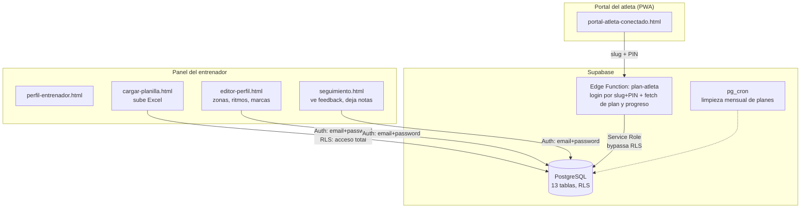
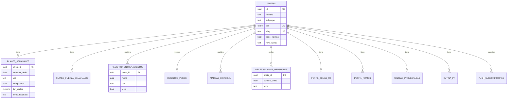

# Gravity Run Club — Portal del Atleta

Sistema de gestión de planes de entrenamiento y feedback para un equipo de running real (Gravity Run Club, Buenos Aires), construido de cero para reemplazar un flujo manual de Excel + WhatsApp por un modelo de datos relacional con autenticación, automatización de carga y seguimiento de progreso.

> **Nota sobre este repo:** el código y el esquema son los reales de producción. Los datos de atletas fueron reemplazados por un roster ficticio (`data/roster_ficticio.sql`) y las credenciales por placeholders — ver `src/` y `edge-functions/`.

## El problema

El entrenador diseñaba los planes semanales de ~50 atletas en Excel y los enviaba uno por uno por WhatsApp. No había forma de que un atleta viera su historial, ni de que el coach supiera si alguien venía cumpliendo o abandonando el plan sin preguntarle directamente. Cada plan nuevo significaba repetir el envío manual, semana tras semana, por atleta.

## Por qué se construyó de cero

El sitio de Gravity Run Club ya existía desde 2019 como landing estático — sin ninguna capa de datos detrás. La decisión no fue "agregarle funciones" a ese landing, sino diseñar un modelo relacional aparte que representara cómo trabaja el equipo realmente: subgrupos por distancia, atletas que combinan running y preparación física en proporciones distintas, planes que cambian semana a semana pero un historial que no se pierde nunca. Migrar un sitio estático no resuelve eso, hacía falta una base de datos.

## Arquitectura



**Dos caminos de acceso muy distintos, a propósito:** el coach entra con usuario/contraseña real (Supabase Auth) y tiene permiso total vía RLS. El atleta entra con un PIN de 4 dígitos pensado para uso casual desde el celular, no tiene ninguna política RLS propia; todo pasa por la Edge Function `plan-atleta`, que valida el PIN a mano y aplica rate limiting (5 intentos → bloqueo de 15 minutos) antes de tocar la base.

## Modelo de datos



**Decisión clave:** las tablas se dividen en dos familias con ciclos de vida distintos. `planes_semanales` / `planes_fuerza_semanales` y se borran automáticamente a los 30 días vía `pg_cron` para no acumular basura. `registro_entrenamientos` / `registro_pesos` / `marcas_historial` son histórico real (lo que el atleta *efectivamente hizo*) y no se borran nunca. Mezclar ambas cosas en una sola tabla hubiera obligado a elegir entre perder el historial o acumular planes viejos indefinidamente.

El modelo de atleta también combina dos ejes independientes (`tiene_running` boolean + `nivel_fuerza` enum) en vez de un tipo único, porque en la realidad un atleta puede correr y hacer entrenamiento de fuerza a la vez, en cualquier combinación — ver `sql/01_schema.sql` para el detalle de por qué había un campo `tipo_plan` legacy que este modelo reemplazó.

## Cómo se construyó — línea de tiempo

1. **Diseño del esquema** desde cero, sobre el modelo real de subgrupos y planes de entrenamiento (no sobre el landing viejo).
2. **Autenticación del atleta** vía Edge Function (slug + PIN), con rate limiting.
3. **Carga automatizada de planillas**: el coach sigue trabajando en Excel y el sistema detecta el tipo de plan por el nombre de la hoja, matchea atletas por nombre (con sugerencias por distancia de Levenshtein si hay un typo), detecta filas duplicadas dentro del mismo archivo, y borra + reinserta por semana para evitar filas huérfanas.
4. **Sistema de feedback**: se extendió la Edge Function original (que solo devolvía el plan) para traer también el historial completo de progreso, y se agregó la pestaña "Progreso" al portal con feedback de ritmo por sesión y notas del entrenador.
5. **Sistema de notificaciones push**, en dos partes separadas por el tiempo: primero se construyó la suscripción (el atleta acepta desde el botón "Avisame los días que tengo entreno", la tabla `push_subscripciones` se puebla) y bastante después la función que efectivamente envía el push, con tres disparadores distintos (recordatorio diario, plan nuevo, nota del coach) y limpieza automática de suscripciones vencidas.
6. **PWA instalable**, para que el atleta lo tenga como un ícono más en el celular en vez de un link perdido en un chat de WhatsApp.

## Desafíos y decisiones (lo que se corrigió con el uso)

Esta sección es literalmente el orden en el que fueron apareciendo los problemas, no una lista prolija escrita después con el diario del lunes.

**Performance, lo primero que se notó:** el `index.html` original tenía 45 imágenes embebidas en base64, llevando el archivo a 4.4MB y un PageSpeed mobile de 47/100. Se extrajeron a una carpeta `images/` con compresión y lazy loading.

**Fallas silenciosas en llamadas a Supabase:** el cliente de Supabase no lanza excepción cuando una query falla — devuelve `{ data: null, error }`. Varias partes del código usaban `r.data || []` sin chequear `r.error`, lo que hacía que ciertas fallas (como una columna mal referenciada) no aparecieran en ningún log y simplemente mostraran "sin datos" al usuario, sin ninguna pista de por qué. Quedó como lección aplicada de forma más consistente en los módulos más nuevos (carga de planillas, guardado de progreso), que sí revisan `error` en cada paso — no en todo el código por igual, porque no se reescribió lo viejo solo por prolijidad.

**El nombre del archivo fuente nunca es el nombre real de la función desplegada.** Pasó dos veces: `plan-atleta.ts` corre en producción como `dynamic-processor` (o corría — no quedó del todo claro si es la misma función renombrada o una versión anterior reemplazada), y `guardar-progreso.ts` corre como `rapid-task`. Supabase asigna el nombre al momento del deploy, no lo toma del archivo. Documentarlo acá para no perder el rastro la próxima vez que alguien busque "dynamic-processor" en el código y no lo encuentre.

**`CREATE POLICY IF NOT EXISTS` no existe en PostgreSQL** — a diferencia de `CREATE TABLE` o `CREATE INDEX`, esa cláusula no es válida para políticas. Apareció al intentar armar un script de schema que fuera re-ejecutable desde cero para levantar un entorno de prueba; el patrón correcto es `DROP POLICY IF EXISTS` + `CREATE POLICY` (ver `sql/02_rls_policies.sql`).

**El resumen del schema que se armó a mano tenía dos columnas mal documentadas**, y se destaparon recién al construir este mismo repo — no antes. `observaciones_mensuales` se había escrito como si tuviera una columna `mes`, cuando en producción es `semana_inicio` (el nombre de la tabla sugiere "mensual", pero la granularidad real es semanal). Y a `registro_entrenamientos` le faltaba `visto`, la columna que usa el panel de Seguimiento del coach para el filtro de "no vistos". Las dos se confirmaron contra `information_schema.columns` en la base real antes de corregir nada — la lección más concreta de todo el proceso fue no confiar en un resumen escrito de memoria cuando existe la posibilidad de preguntarle directamente a la base.

**Una constraint que hubo que confirmar a mano:** `guardar-progreso.ts` hace un `upsert` sobre `push_subscripciones` con `onConflict: 'atleta_id,endpoint'`. Antes de darlo por bueno, se verificó contra `pg_constraint` en producción — existe (`push_subscripciones_atleta_id_endpoint_key`), así que esa línea está bien tal como está. Se confirma acá en vez de asumirlo, mismo criterio que con las columnas del punto anterior.

**PIN guardado en `localStorage` en texto plano** para el "recordarme" del atleta: una decisión consciente de trade-off, no un descuido. El PIN de 4 dígitos solo protege ver un plan de entrenamiento — no hay datos financieros ni médicos detrás — así que el costo de implementar tokens de sesión con expiración no se justificaba en esta etapa. El camino para hacerlo más robusto (token aleatorio + tabla de sesiones con expiración, en vez del PIN real) está documentado para si la app creciera.

**Matching de nombres al subir el Excel:** con ~28 atletas y typos ocasionales en la planilla, un matching exacto de texto generaba fallas silenciosas — un atleta se quedaba sin plan esa semana, sin que nadie lo notara hasta que preguntaba por WhatsApp. Se agregó sugerencia por distancia de Levenshtein para detectar el candidato más probable y avisar antes de publicar, además de detección de filas duplicadas dentro del mismo archivo.

**El recordatorio diario por push no cubre a los atletas de preparación física, y es a propósito, no un descuido.** El disparador que avisa "hoy tenés entreno" solo consulta `planes_semanales`, la única tabla con estructura por día de la semana. `planes_fuerza_semanales` se organiza por bloque, sin día fijo asociado — y no es que faltó modelarlo: los días de entreno de fuerza varían de atleta a atleta y no siguen un calendario semanal fijo como sí lo hace running, así que forzarle una estructura de "día de la semana" al modelo hubiera sido inventar una regularidad que no existe en la realidad del club. Hoy el grupo de atletas de fuerza pura es chico, así que el costo de esta brecha es bajo — queda anotado como algo a revisar si ese grupo creciera y la falta del recordatorio empezara a pesar más.

**Las suscripciones push se limpian solas.** Cuando un endpoint de suscripción devuelve 410 o 404 al intentar enviarle (el atleta reinstaló la app, borró datos del sitio, etc.), la función de notificaciones borra esa fila de `push_subscripciones` en el momento, en vez de seguir intentando enviarle para siempre a una suscripción muerta.

## Stack

- **Frontend:** HTML/CSS/JS vanilla, sin build step — 5 páginas, cada una con un rol claro (coach vs. atleta)
- **Backend:** Supabase (PostgreSQL + Edge Functions en Deno + Row Level Security + pg_cron), free tier
- **Autenticación:** Supabase Auth para el coach; PIN + Edge Function custom para el atleta
- **PWA:** service worker con caching network-first, instalable en el celular del atleta

## Estructura de este repo

```
sql/
  01_schema.sql              esquema completo, fiel a producción
  02_rls_policies.sql        políticas de seguridad por fila
  03_functions_triggers.sql  limpieza automática vía pg_cron
  queries/                   queries de negocio resueltas (progreso, adherencia, alertas)
edge-functions/
  plan-atleta.ts              login + fetch de plan y progreso del atleta (desplegada como "dynamic-processor")
  guardar-progreso.ts         guarda feedback del atleta (desplegada como "rapid-task")
  notificaciones.ts           los 3 disparadores de push (recordatorio diario, plan nuevo, nota del coach)
src/                          las 5 páginas del sistema (credenciales sanitizadas)
data/
  roster_ficticio.sql        atletas de ejemplo para levantar el entorno de prueba
docs/screenshots/             capturas del instructivo de uso para atletas
```

## Estado actual y próximos pasos

En uso real con el roster completo del club. El código de `notificaciones.ts` ya está escrito con sus tres disparadores; su despliegue efectivo en producción es lo único de esta lista que no se pudo confirmar en el momento de escribir esto. Otro pendiente: evaluar si vale la pena migrar el "recordarme" del atleta de PIN-en-localStorage a un token de sesión con expiración.
